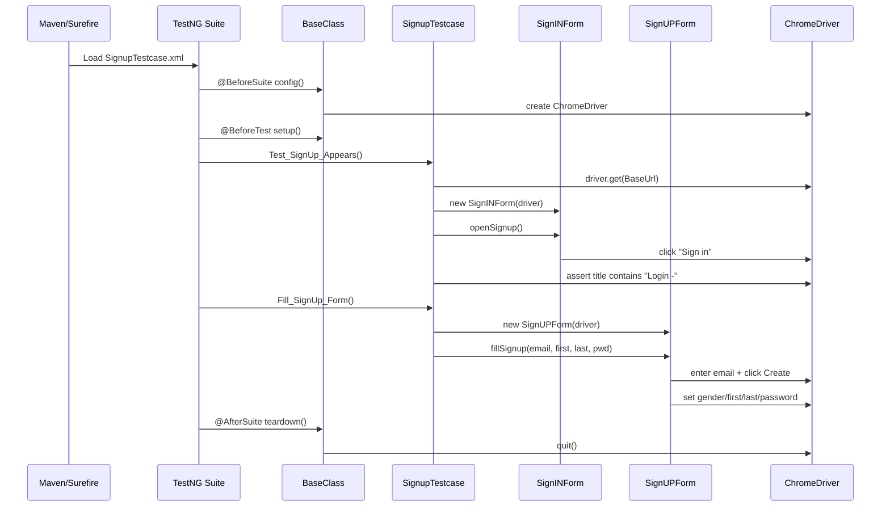

# P_O_M_Framework Process Flow

This document describes how automated tests in this repository execute end-to-end.

## 1) High-level execution flow

```mermaid
flowchart TD
    A[Start test run] --> B{How is suite started?}
    B -->|mvn test| C[Surefire reads SignupTestcase.xml]
    B -->|testng xml directly| D[Chosen suite XML under repo root]

    C --> E[TestNG loads suite + test classes]
    D --> E

    E --> F[@BeforeSuite in BaseClass.config]
    F --> G[WebDriverManager resolves drivers]
    G --> H[ChromeDriver is created]
    H --> I[@BeforeTest BaseClass.setup]
    I --> J[Browser timeouts + window + wait configured]

    J --> K[Test method in class under TestModel / other packages]
    K --> L[Page Object methods perform actions]
    L --> M[Assertions validate expected behavior]

    M --> N{Listeners enabled?}
    N -->|Yes| O[Retry / screenshot listeners react on failures]
    N -->|No| P[Continue]

    O --> P
    P --> Q[TestNG builds reports in test-output]
    Q --> R[@AfterSuite BaseClass.teardown]
    R --> S[Driver quits and run ends]
```

## 2) Runtime components and responsibilities

| Layer | Responsibility | Key files |
|---|---|---|
| Build + runner | Defines dependencies/plugins and default suite file used by Maven test execution. | `pom.xml`, `SignupTestcase.xml` |
| Base test lifecycle | Browser setup/teardown and shared driver objects. | `src/main/java/basemodel/BaseClass.java` |
| Test scenarios | Business-level test flow (navigation, form actions, assertions). | `src/main/java/TestModel/SignupTestcase.java` |
| Page objects | Encapsulate UI locators and operations using Selenium/PageFactory. | `src/main/java/pageModel/SignINForm.java`, `src/main/java/pageModel/SignUPForm.java` |
| Object-repo style ops (alternate pattern) | Loads locator properties and performs keyword-style operations. | `src/main/java/operations/readobject.java`, `src/main/java/operations/uioperation.java` |
| Execution configuration variants | Grouping, listeners, parallel modes, and data-provider suites. | `testng.xml`, `ListenersPack1.xml`, `Gropusng.xml`, `Datapro.xml`, `testmethod.xml` |
| Reporting artifacts | TestNG output, emailable report, junit XML snapshots. | `test-output/` |

## 3) Default Maven path (what runs by default)

1. Run `mvn test`.
2. Maven Surefire uses `SignupTestcase.xml` as suite input.
3. TestNG runs `TestModel.SignupTestcase`.
4. `BaseClass.config()` starts WebDriver and sets base URLs.
5. `BaseClass.setup()` applies timeout/window/wait settings.
6. `Test_SignUp_Appears` opens the automation practice URL and validates title after opening sign-in.
7. `Fill_SignUp_Form` fills sign-up fields through `SignUPForm` page object methods.
8. After execution, TestNG writes reports under `test-output/` and `BaseClass.teardown()` quits the browser.

## 4) Detailed sequence for the sign-up scenario



## 5) Alternate execution flows available in repo

- **Listener + retry flow** (`ListenersPack1.xml` / `testng.xml`): registers listener classes to retry failed tests and optionally capture screenshots on failure.
- **Grouped execution flow** (`testmethod.xml`, `Gropusng.xml`): runs selected TestNG groups or parallelized class/method execution.
- **Data provider flow** (`Datapro.xml`, `DataProviderXML/ParamTest1.xml`): executes tests with externalized parameter sets.

## 6) Practical runbook

### Run default suite

```bash
mvn test
```

### Run a specific suite file

```bash
mvn -Dtestng.xml=ListenersPack1.xml test
```

(If your Maven/TestNG setup ignores that property, run the suite directly from IDE or adjust Surefire suite configuration.)

## 7) Notes and caveats

- `BaseClass` currently initializes Chrome by default; Firefox/Edge setup lines are present but commented.
- Some suite XML files reference classes/packages with naming mismatches (legacy examples), so not every XML is guaranteed to pass without cleanup.
- `operations/readobject.java` expects an object repository at `src/Objectrepo/repo1.properties`, while a properties file is currently located at `src/main/java/framework/repo1.properties`.

