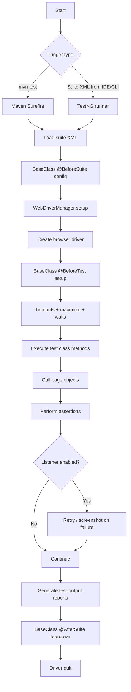
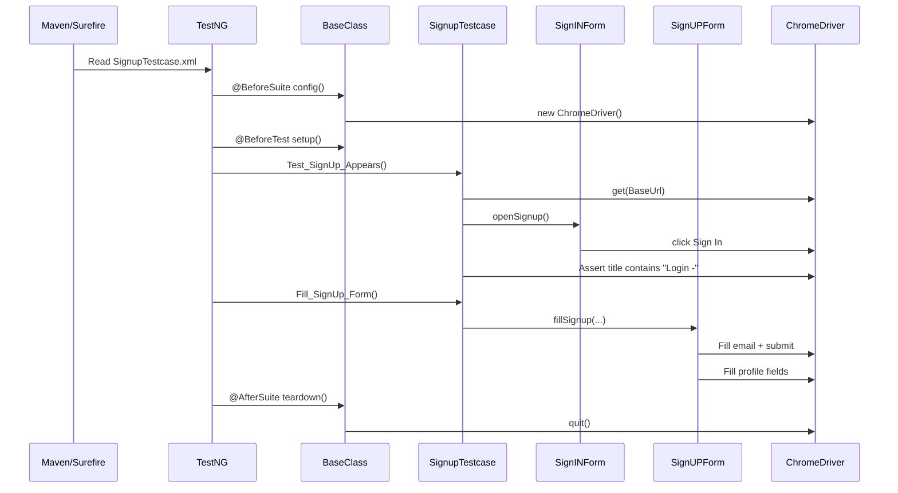

# P_O_M_Framework Process Flow (Updated)

This guide explains the **current end-to-end flow** of this Selenium + TestNG Page Object Model framework, with extra focus on:

- how we execute and test the framework,
- how we open/view results,
- and which tools we use day-to-day.

## 1) End-to-end process flow



## 2) Framework architecture map

| Layer | Purpose | Main files |
|---|---|---|
| Build + dependency management | Controls dependencies, compiler, surefire suite wiring. | `pom.xml` |
| Suite definitions | Defines what classes run, in what mode (parallel/groups/listeners). | `SignupTestcase.xml`, `testng.xml`, `ListenersPack1.xml`, `Datapro.xml`, `Gropusng.xml`, `testmethod.xml` |
| Test lifecycle base | Creates driver, sets base URLs, handles setup/teardown. | `src/main/java/basemodel/BaseClass.java` |
| Business test scenarios | Implements scenario steps/assertions. | `src/main/java/TestModel/SignupTestcase.java`, `src/main/java/TestModel/SignInTestcase.java`, `src/main/java/TestModel/RunSignUp.java`, `src/main/java/TestModel/RunSignIn.java` |
| Page objects | Encapsulates element locators and actions. | `src/main/java/pageModel/SignINForm.java`, `src/main/java/pageModel/SignUPForm.java`, `src/main/java/pageModel/SignInPage.java`, `src/main/java/pageModel/SignInformPage.java` |
| Keyword/object-repo utility path | Alternate keyword-driven operation model. | `src/main/java/operations/uioperation.java`, `src/main/java/operations/readobject.java` |
| Outputs | HTML/XML results and historical run artifacts. | `test-output/`, `test-output/junitreports/` |

## 3) Primary sign-up sequence (default suite)



## 4) How we test this framework (emphasized)

### A) Test execution modes

1. **Default regression path**
   - Command: `mvn test`
   - Uses Surefire config in `pom.xml` and suite file `SignupTestcase.xml`.

2. **Listener and retry validation**
   - Run with `ListenersPack1.xml` or `testng.xml`.
   - Useful for failure-handling behavior and automatic retry/screenshot logic.

3. **Group-based testing**
   - Use `Gropusng.xml` or `testmethod.xml`.
   - Validates smoke/function groups and parallel behavior.

4. **Data-driven testing**
   - Use `Datapro.xml` and data-provider classes.
   - Validates parameterized/iterative input handling.

### B) What we verify in each run

- **Driver lifecycle health**: browser starts once and closes cleanly.
- **Navigation correctness**: app loads expected URL/pages.
- **Element interaction stability**: form fields/buttons are discoverable and interactable.
- **Assertion quality**: title/content checks fail loudly when behavior changes.
- **Failure diagnostics**: retries and screenshots are produced when configured.
- **Report generation**: HTML and XML reports are generated in `test-output/`.

### C) Suggested practical validation checklist

- Run default suite (`mvn test`).
- Run one listener-enabled suite.
- Run one group/parallel suite.
- Confirm `test-output/index.html` is refreshed.
- Confirm `test-output/junitreports/*.xml` exists for CI parsers.

## 5) How to open and view reports + artifacts

### A) Open TestNG HTML reports

After a run, open these files in browser:

- `test-output/index.html` (main dashboard)
- `test-output/emailable-report.html` (shareable summary)

Example (Linux):

```bash
xdg-open test-output/index.html
xdg-open test-output/emailable-report.html
```

### B) View XML outputs for CI/debug

- `test-output/testng-results.xml`
- `test-output/junitreports/TEST-*.xml`

These files are useful for Jenkins/GitHub Actions test parsing and flaky test triage.

### C) View screenshots from test runs

Screenshot artifacts in this repository include:

- `path/screenshot1.png`
- `path/screenshot2.png`
- `yourpath/screenshot3.png`

Open locally with any image viewer, for example:

```bash
xdg-open path/screenshot1.png
```

## 6) Tools we use in this framework

- **Maven**: dependency management and suite execution orchestration.
- **TestNG**: test structure (`@BeforeSuite`, `@Test`, grouping, parallel, listeners).
- **Selenium WebDriver**: browser automation actions/assertions.
- **WebDriverManager**: automatic driver binary setup.
- **Ashot**: screenshot support for visual captures.
- **PageFactory + POM classes**: UI abstraction for maintainable selectors/actions.

## 7) Common commands (quick runbook)

```bash
# 1) Compile only
mvn -DskipTests compile

# 2) Run default suite
mvn test

# 3) Clean + run
mvn clean test
```

> Note: For non-default suites, run directly from your IDE TestNG runner or update Surefire `suiteXmlFiles` temporarily in `pom.xml`.

## 8) Current caveats

- `BaseClass` initializes Chrome by default; Firefox/Edge setup is present but commented.
- A few XML files reference legacy class names/packages and may need cleanup before successful execution.
- `readobject` expects `src/Objectrepo/repo1.properties`, while an existing properties file is under `src/main/java/framework/repo1.properties`.
